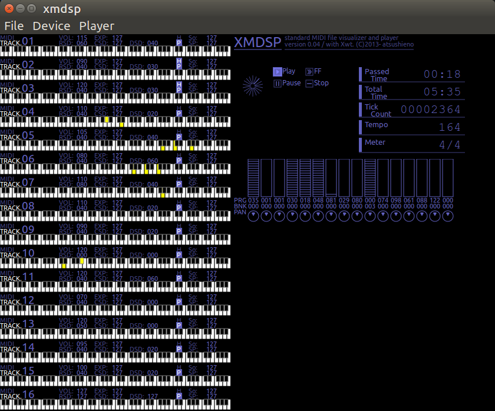

What is this?
=============

XMDSP is a visual SMF (standard MIDI file) player that is meant to be cross-platform. It is written on top of [Mono](https://github.com/mono/mono)/.NET and [Xwt](https://github.com/mono/xwt).

(The primary target desktop is Linux/GNOME. XMDSP on OSX will be based on Xwt.XamMac and waiting for a Xamarin.Mac bugfix release. XMDSP on Windows is based on Xwt.WPF which is known to work. Experimental mobile projects are known to not work.)

XMDSP is pretty much inspired by ancient Japanese music players such as [MMDSP](https://github.com/gaolay/MMDSP) but to support SMF instead of FM synthesizers as of those ages.

SMF player part uses [managed-midi](https://github.com/atsushieno/managed-midi).

